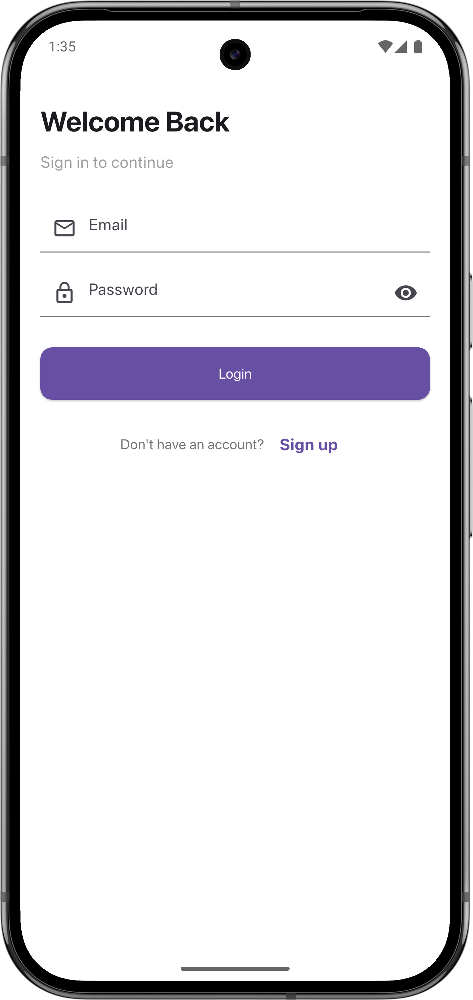
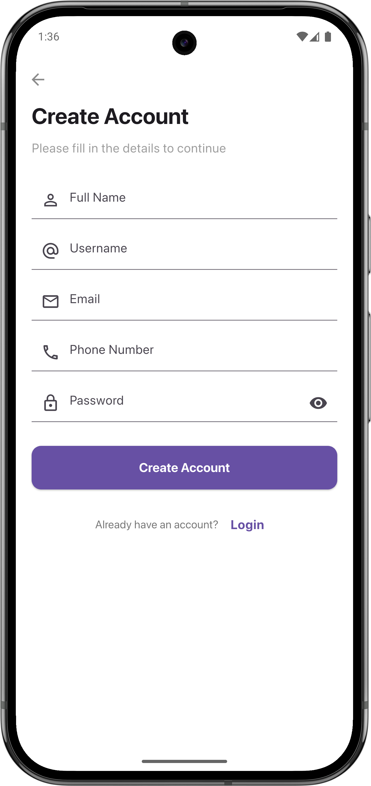
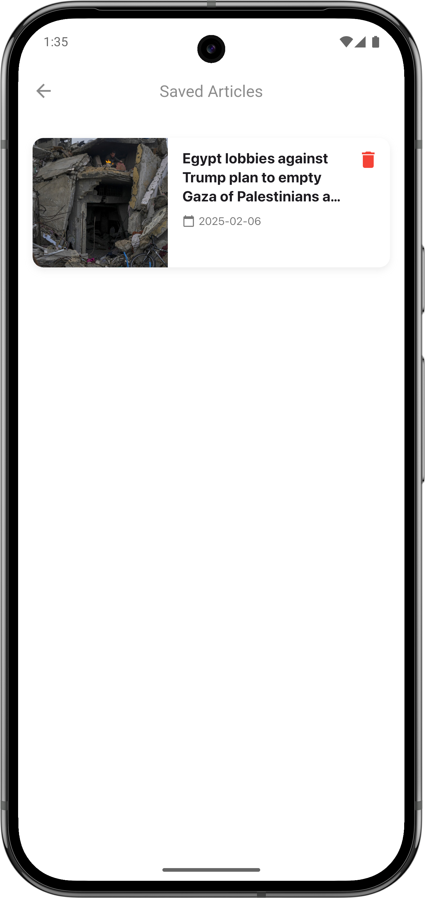

# News App

A Flutter-based news application built with Clean Architecture. The app allows users to read the
latest news articles, sign in/up, save their favorite articles, and view detailed content. It
features a clean, modern UI with interactive gestures such as swipe-to-delete and pull-to-refresh.

## Features

- **Authentication:** Secure login and signup screens
- **Latest News:** Browse the latest articles
- **Favorites:** Save articles for later reading
- **Article Details:** Read full articles in detail
- **Interactive UI:** Swipe to delete saved articles and pull to refresh

## Screenshots

### Login & Signup

|                  Login                   |                  Signup                   |
|:----------------------------------------:|:-----------------------------------------:|
|  |  |

### News, Favorite & Details

|                  News                   |                  Favorite                   |                  Details                   |
|:---------------------------------------:|:-------------------------------------------:|:------------------------------------------:|
|  |  |  |
